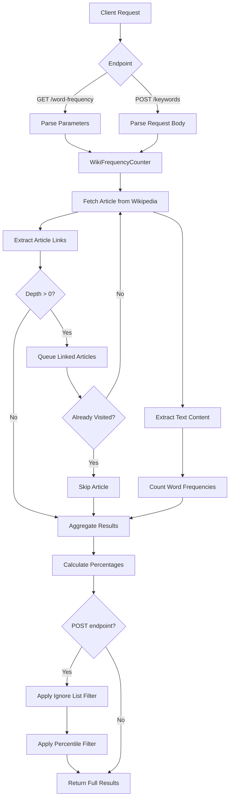

# Wikipedia Word-Frequency Dictionary

A FastAPI application that analyzes word frequency across Wikipedia articles by recursively traversing article links up to a specified depth.

## Overview

This application fetches Wikipedia articles, extracts their content and links, then recursively processes linked articles to build a comprehensive word-frequency analysis. It tracks visited articles to prevent infinite loops and provides filtering capabilities for refined keyword extraction.

## Process Flow



## API Endpoints

### `GET /word-frequency`
Analyzes word frequency across Wikipedia articles.

**Parameters:**
- `article` (string): Wikipedia article title (e.g., "Python", not URL)
- `depth` (int): Traversal depth (1-5)

**Response:**
```json
{
  "word": {
    "count": 42,
    "percentage": 2.5
  }
}
```

### `POST /keywords`
Returns filtered word frequency analysis.

**Request Body:**
```json
{
  "article": "Python",
  "depth": 2,
  "ignore_list": ["the", "a", "an"],
  "percentile": 75
}
```

**Response:** Same format as `/word-frequency`, but filtered by ignore list and percentile threshold.

## Docker Setup

### Prerequisites
- Docker
- Docker Compose

### Running with Docker Compose

1. **Copy the environment file:**
   ```bash
   cp .env.example .env
   ```

2. **Build and start the application:**
   ```bash
   docker-compose up --build
   ```

3. **Access the API:**
   - API Documentation: http://localhost:8000/docs
   - Alternative Documentation: http://localhost:8000/redoc

4. **Stop the application:**
   ```bash
   docker-compose down

### Environment Variables

Configure in your `.env` file:

| Variable | Description | Default |
|----------|-------------|---------|
| `WIKIPEDIA_LANG` | Wikipedia language code | `en` |
| `REQUEST_TIMEOUT` | HTTP request timeout in seconds | `30.0` |
| `MAX_CONCURRENT_REQUESTS` | Maximum concurrent requests | `5` |
| `MAX_DEPTH` | Maximum traversal depth | `5` |
| `USER_AGENT` | Custom user agent string | (optional) |

## Local Development

### Prerequisites
- Python 3.12+
- Poetry

### Setup

1. **Install dependencies:**
   ```bash
   poetry install
   ```

2. **Configure environment:**
   ```bash
   cp .env.example .env
   ```

3. **Run the application:**
   ```bash
   poetry run fastapi dev main.py
   ```

4. **Run tests:**
   ```bash
   poetry run pytest
   ```

4. **Run tests coverage: <i>(95% coverage)</i>**
   ```bash
   poetry run pytest --cov=. --cov-report=term-missing
   ```


## Project Structure

```
.
├── src/
│   └── wiki_client.py       # Core Wikipedia traversal logic
├── utils/
│   └── filters.py           # Word filtering utilities
├── tests/
│   ├── unit/                # Unit tests
│   └── integration/         # Integration tests
├── main.py                  # FastAPI application
├── schema.py                # Pydantic models
├── config.py                # Configuration management
├── logging_config.py        # Logging setup
├── Dockerfile               # Docker image definition
└── docker-compose.yml       # Docker Compose configuration
```

## Features

- **Recursive Traversal**: Follows Wikipedia links up to specified depth
- **Cycle Detection**: Tracks visited articles to prevent infinite loops
- **Concurrent Processing**: Handles multiple article fetches efficiently
- **Flexible Filtering**: Supports ignore lists and percentile-based filtering
- **Comprehensive Testing**: Unit and integration tests included
- **Docker Support**: Containerized deployment ready

## Task description


## Objective
Develop a Python server application that takes an article and a depth parameter as input, and generates a word-frequency dictionary by traversing Wikipedia articles up to the specified depth.
Traversing Functionality:
- The application should start with the given article and retrieve its content.
- It should then identify and follow the links to other Wikipedia articles referenced within the original article.
- This process should continue recursively, up to the specified depth parameter.
- For example, if depth is set to 2, the application should analyze the original article, the articles referenced by the original article, and the articles referenced by those articles.
- Ensure that the traversal does not revisit articles that have already been processed to avoid infinite loops.

## Requirements

### APIs
`[GET] /word-frequency`
- Parameters: 
  - article (string): The title of the Wikipedia article to start from.
  - depth (int): The depth of traversal within Wikipedia articles.
- Response: 
  - A word-frequency dictionary that includes the count and percentage frequency of each word found in the traversed articles.

`[POST] /keywords`
- Request Body:
  - article (string): The title of the Wikipedia article.
  - depth (int): The depth of traversal.
  - ignore_list (array[string]): A list of words to ignore.
  - percentile (int): The percentile threshold for word frequency.
- Response: 
  - A dictionary similar to the one returned by /word-frequency, but excluding words in the ignore list and filtered by the specified percentile.

## Additional Requirements:
- No authentication is required.
- No database is needed.
- Include unit tests for your code.
- You are encouraged to use AI tools if needed.

## Submission:
- Push your code to a GitHub repository.
- Share the repository link with us.